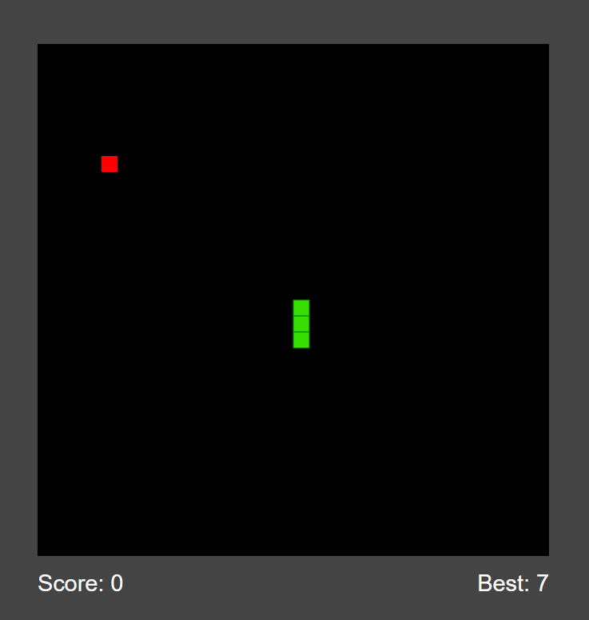

# Snake-game

# Calculator
 
> Here is a working live [_demo_](https://alechowski.github.io/Snake-game/).

## Table of Contents
* [General Info](#general-information)
* [Room for Improvement](#room-for-improvement)

## General Information
 - This is my first game created in JavaScript. I drew inspiration from various video courses and similar game projects during its development.

     

## Room for Improvement
 - In the near future, I plan to refactor this project to be more object-oriented and potentially work on improving the graphical aspects.

---

 Created by alechowski

